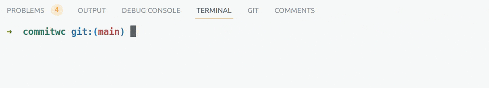

# `commitwc`

A CLI tool that helps you keep your commit messages concise so that message length complies
with the 50/72 rule / is short enough not to be wrapped on Github / complies with your
team's commit message style guide.

- counts the number of characters in your commit message
- copies the message to the clipboard



### Installation

*Assuming that `~/.local/bin` is in your `$PATH`.*

##### Via downloading a binary

```bash
wget https://raw.githubusercontent.com/v-spassky/commitwc/main/bin/commitwc -P ~/.local/bin
```

##### Via building from source code

```
git clone https://github.com/v-spassky/commitwc.git
```

```
cd commitwc
```

```
cargo build --release
```

```
cp target/release/commitwc ~/.local/bin
```

### Usage

Launch the `commitwc` command and type your commit message. The tool will count the number of words in your commit message. After you press `Enter`, the tool will copy the message to the clipboard and exit.
